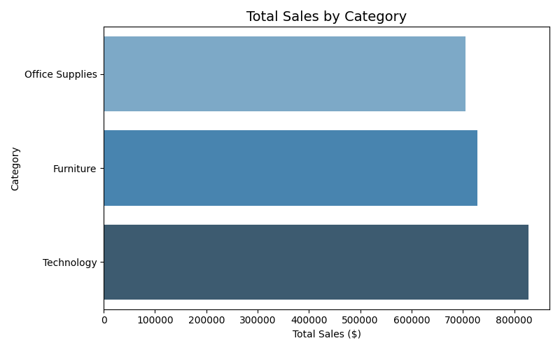
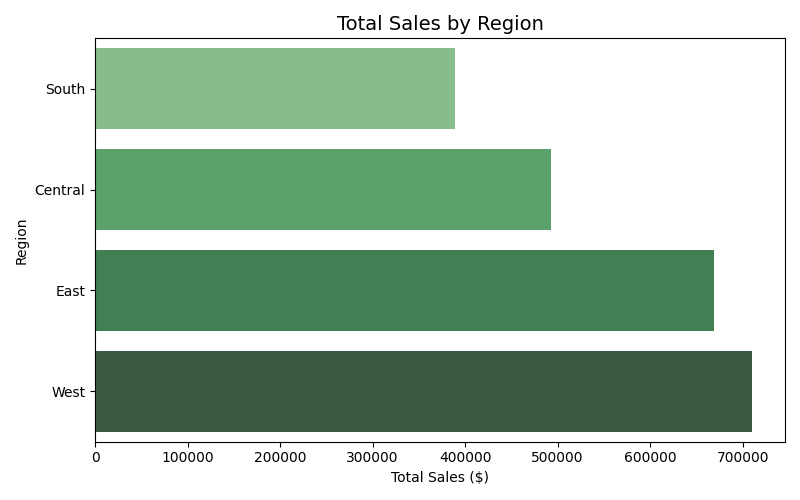
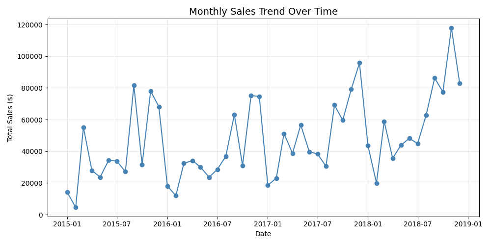
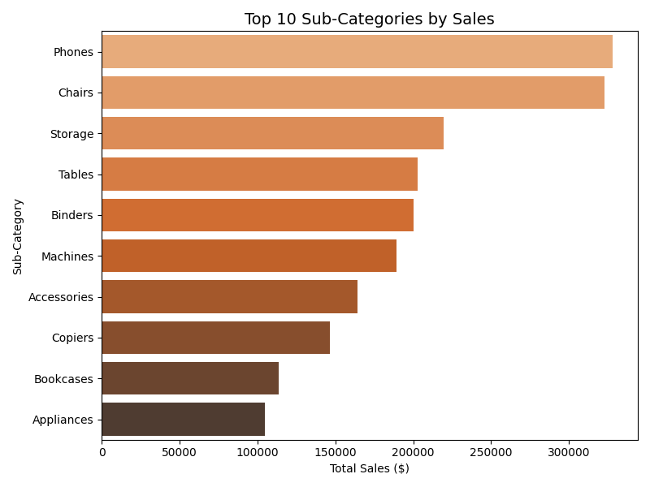

# 🛒 Superstore Sales Analysis

## Overview
Exploratory data analysis on a global superstore dataset with 9,800 orders 
and $2.26 million in total sales revenue.

## Tools Used
- Python
- Pandas (data cleaning & analysis)
- Matplotlib & Seaborn (data visualization)

## Key Findings
- **Technology** is the highest revenue category (~$820,000)
- **West region** leads all regions in total sales
- Sales show a clear **upward trend** from 2015 to 2018
- **Phones and Chairs** are the top 2 best-selling sub-categories

## Charts

## Dataset
Source: [Superstore Sales Dataset - Kaggle](https://www.kaggle.com/datasets/rohitsahoo/sales-forecasting)
